## 
 Web信息处理与应用 实验报告 

### 
 lab1 

### 团队成员
- 何春望 PB17000075
- 吴健宗 PB17000082

### 实验内容
本实验要求以给定的邮件数据集为基础，实现一个邮件搜索引擎。对于给定的查询，能够以**精确查询**和**模糊语义匹配**的方式返回最相关的一系列邮件文档。

### 算法描述
- 精确查询（bool 查询）：
对于给定的 bool 查询，如（term1 AND term2 OR NOT term3），根据倒排索引表，返回符合查询的所有文档。
- 模糊语义匹配：
对文档集合建立 tf-idf 矩阵，对输入的语义查询 Q，计算 Q 的 tf-idf 向量 v，并找出 v 与文档集合中的文档相似度最高的文档子集。

### 优化内容
#### 时间复杂度优化
- 跳表指针
  - bool 查询中，对AND，OR的处理，使用了**跳表指针**技术，减少了时间复杂度。

#### 空间复杂度优化
- 减小 tf-idf **矩阵精度**
  - 对 tf-idf 矩阵的设置，从 numpy 默认的 float64 精度减小到 float16 精度。因为在文档数量，单词数量有限的情况下，tf-idf矩阵的可能值实际上是有限的、离散的，不需要很高的精度就可以达到筛选文档相似度最高的文档子集的目标。这样做减少了 tf-idf 矩阵存储的空间复杂度。
  - 对所有文档建立 tf-idf 矩阵时，如果使用 float16 的精度，只需要900MB-1000MB的空间，如果使用 float64，则需要四倍左右的空间。

> 注：实验结果表示，在倒排索引，tf-idf矩阵，单词索引三个数据库中，tf-idf 矩阵占用空间远大于其他两个，因此减少 tf-idf 矩阵的空间大小是最有必要的。

- **去邮件头**处理
  - 针对 enron dataset 的文档格式，我们做了特殊的“去邮件头”处理。具体是：对每一个邮件，先去掉一些对查询帮助不大的内容，如：邮件发送人，接受人，邮件版本(Mime-Version)，日期，邮件编号等。这样做可以减少内存消耗，并大大加快后期的处理速度，同时减小倒排索引表，tf-idf 矩阵等数据库的大小。
  - 经粗略统计，enron dataset 中，每条邮件大概有三分之二是“无效信息”，因此先把它们去掉是很有帮助的。

> 注：去邮件头处理在去除邮件编号，邮件版本等“冗余信息”的同时，貌似还去掉了日期，发件人等在实际应用中可能有效的信息。考虑到本实验的查询词是针对邮件正文进行查询，因此在本实验的查询词范围内，这些信息是无效的；如果需要查询这些信息，在去邮件头处理中不对它们做去除处理即可。

- 去停用词处理
  - 本实验中，我们采用了去停用词处理以减少倒排表和 tf-idf 文档的大小。
  - 我们同时采用了**两个停用词表**，一个是通用英文停用词表，包含 I, you, do 等常用停用词。另一个是针对 enron dataset 的特殊停用词表，包含 enron, com, html 等在该数据集中频繁出现的无效词语。

#### 查询结果优化
- 词根化处理
  - 本实验中，我们调用了 nltk 库对邮件中的单词进行词根化。这样做有利于避免因为词性转化而导致搜索不到目标词的问题。如，用户需要搜索"message"，但某个文档中出现的是"messages"，即“message”的复数形式。如果不做词根化处理，搜索引擎则不会把他们识别为同一个词，导致遗漏的情况。
  - 另外，我们实现了三种不同的词根化方案，可以满足对构建时间和准确度不同的权衡与取舍要求，极大地提高了系统的灵活性。

### 实验结果
- 构建索引时间：3h
- 查询延迟：
  - bool 检索：<1s
  - 语义检索：约10s
- tf-idf矩阵占用空间： 约1GB

### 运行示例

#### build inv-index and tf-idf matrix
运行 `build_index_and_matrix.py`，大约三个小时后，得到结果：

以下是文档频率排行前十的结果，可以看到，基本去除了冗余的**停用词**。
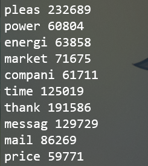

#### bool search
- 选用查询词：power, company, customers, employees, president
- 查询用例
  > 注：查询结果中文档的排序是按照文件名字典序排序的
  - **power AND company AND customers AND employees AND president**
    执行结果：
    
    可以看到，对五个词用AND连起来查询，一共用了0.72s，查询到1816个结果。
    下面是第一个结果的部分内容(../dataset/maildir/arnold-j/all_documents/605_)
    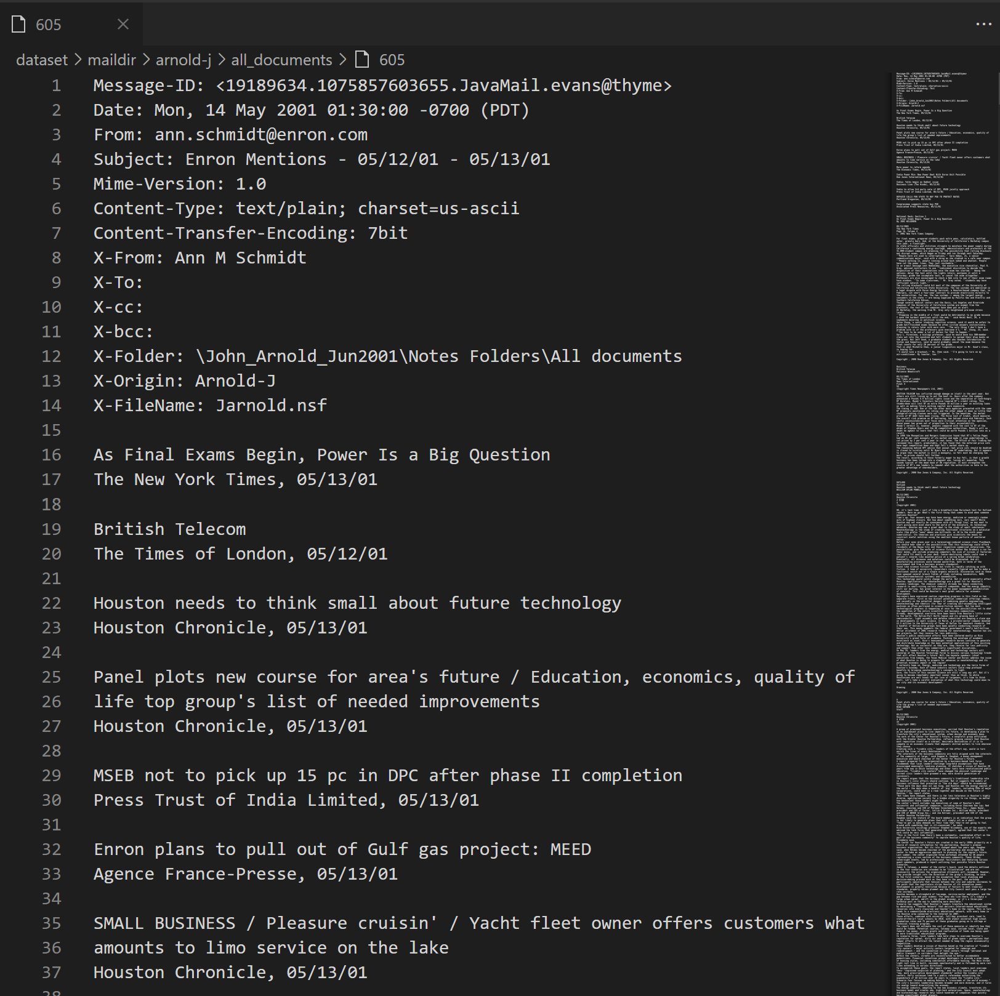
    这是一封长邮件，里面涵盖了全部五个搜索词，正因为搜索词要求五个词都在，所以几乎只有这种长邮件才满足要求。
  - **power AND company OR customers AND employees OR president**
    执行结果：
    
    讲其中两个AND换成OR，搜索结果数量增加为37912个
    
    查看第一个文档，其中含有 president 这个词，结果正确
  - **power AND company AND NOT (customers OR employees OR president)**
    执行结果：
    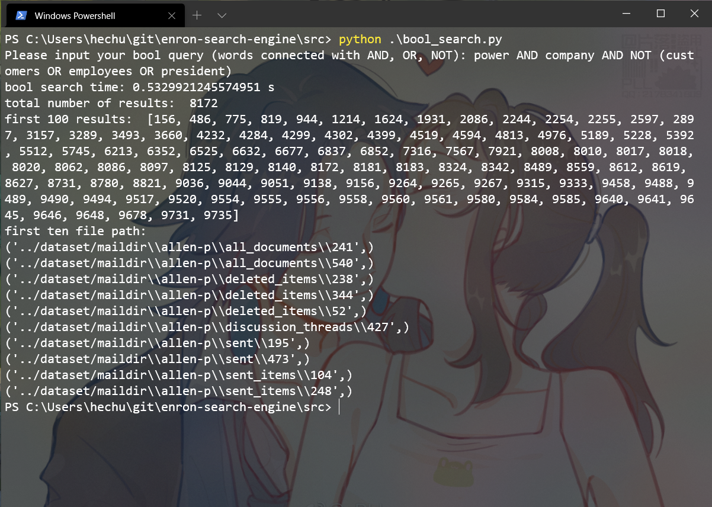
    含有 power 和 company 的同时不含有后面三个词，查询结果有8172个
    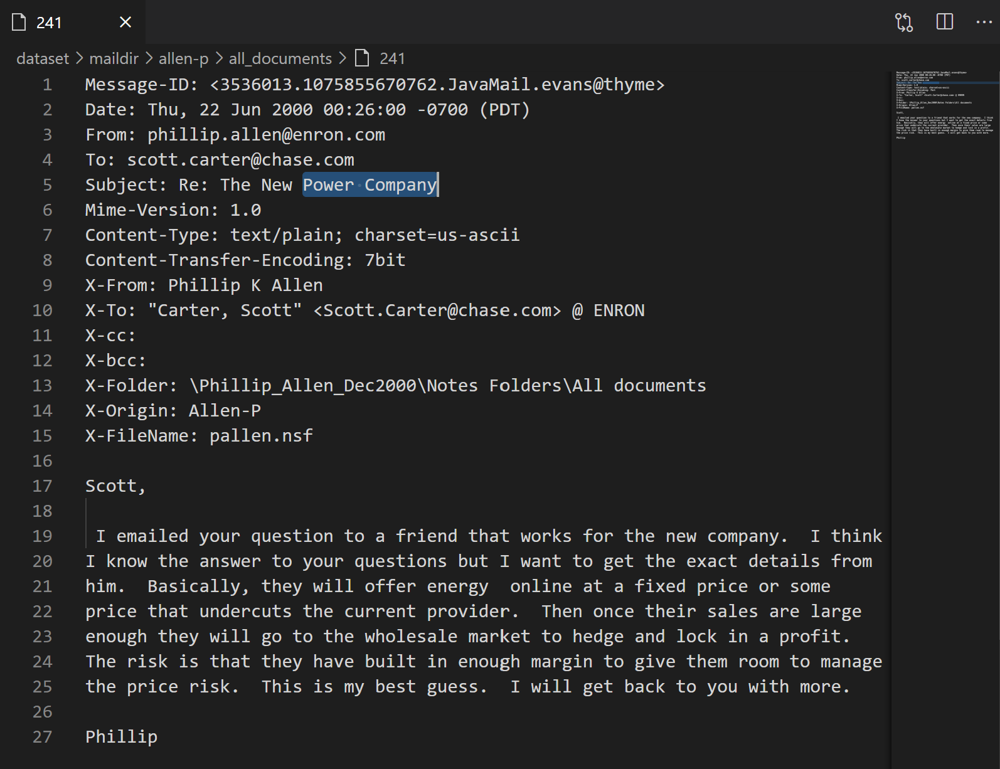
    第一个文档中，含有 Power, Company, 同时不含有其他三个词
  - **NOT power AND NOT company AND NOT customers AND NOT employees AND NOT president**
    执行结果：
    
    搜索不含有这五个词的结果，一共有373787个
  - **power OR company OR customers OR employees OR president**
    执行结果：
    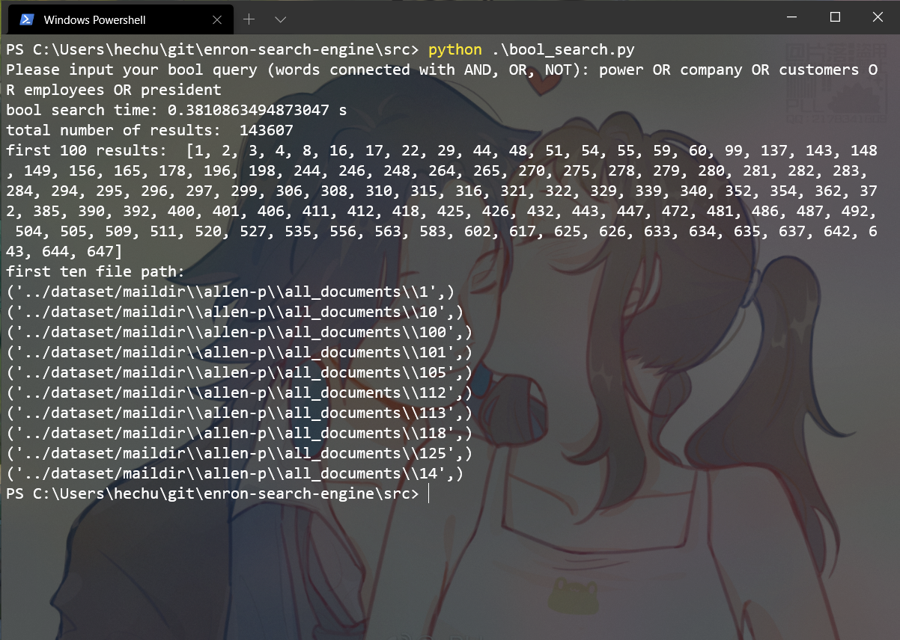
    至少包含一个搜索词的结果，有143614个

#### semantic search
- 选用查询词：opportunity, management, address, offer, price
- 查询用例
  - **opportunity**
    执行结果：
    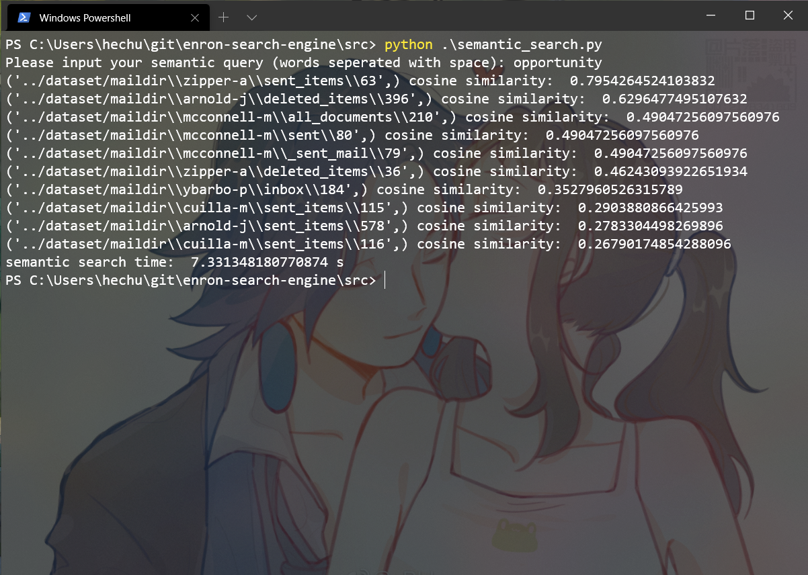
    输出十个匹配度最高的结果
    
    查看第一个结果，短邮件，含有opportunity
  - **opportunity, management**
    执行结果：
    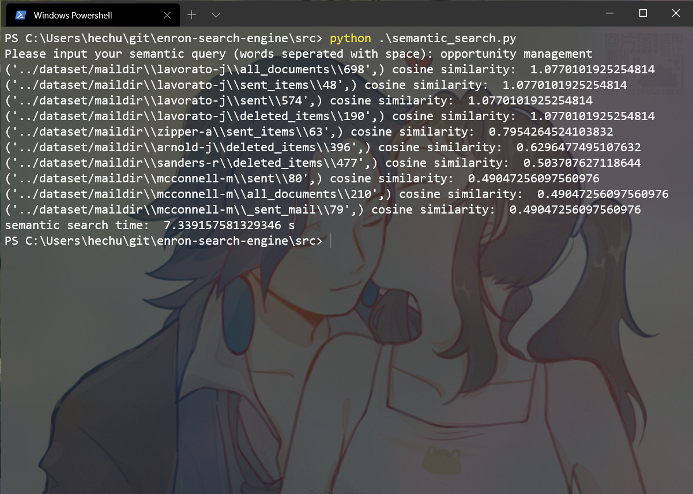
    分别展现第一和第十的结果
    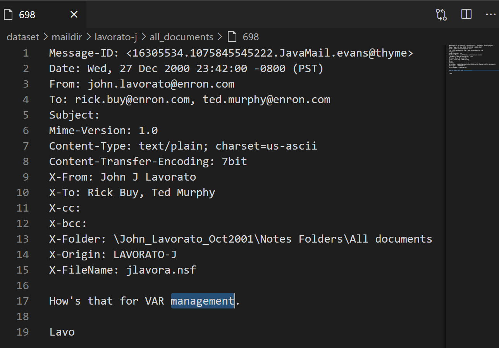
    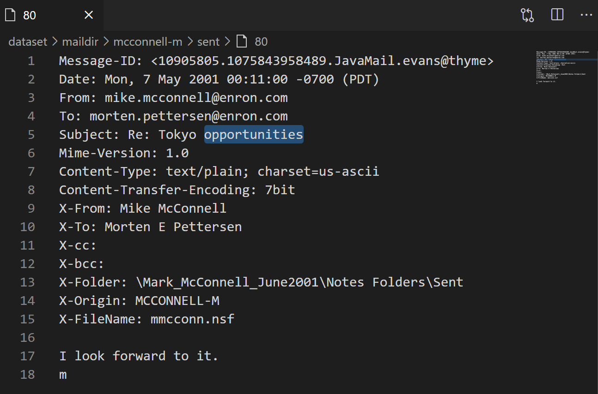
    分别是含有一个 management 和一个 opportunities 的邮件
    含有 management 的邮件排行高于含有 opportunities 的邮件的原因是 management 的文档频率低于 opportunity，搜索引擎认为频率越低的词含有更丰富的信息。
    另外，在排行第十的结果中， opportunity 以复数形式存在，这里体现了**去词根化**的结果，可以将一个词的不同形式都识别出来。
  - **opportunity, management, address**
    执行结果：
    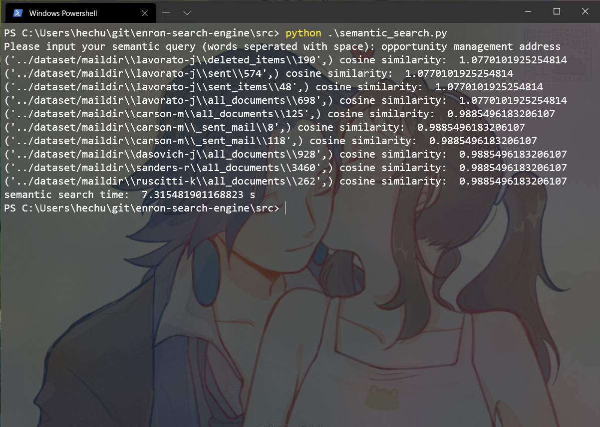
    展现第一和第十的结果
    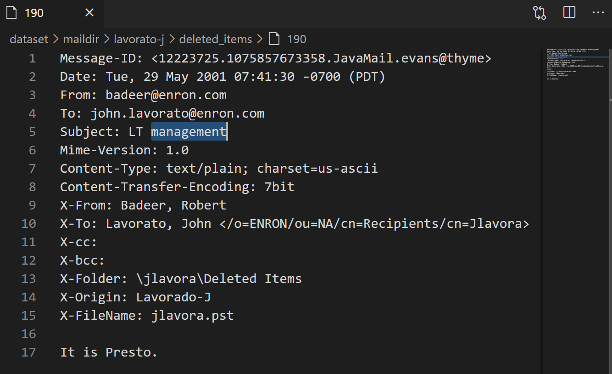
    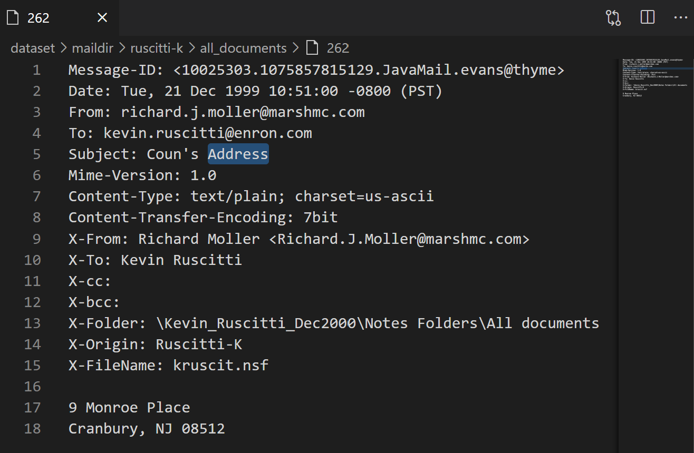
  - **opportunity, management, address, offer**
    执行结果：
    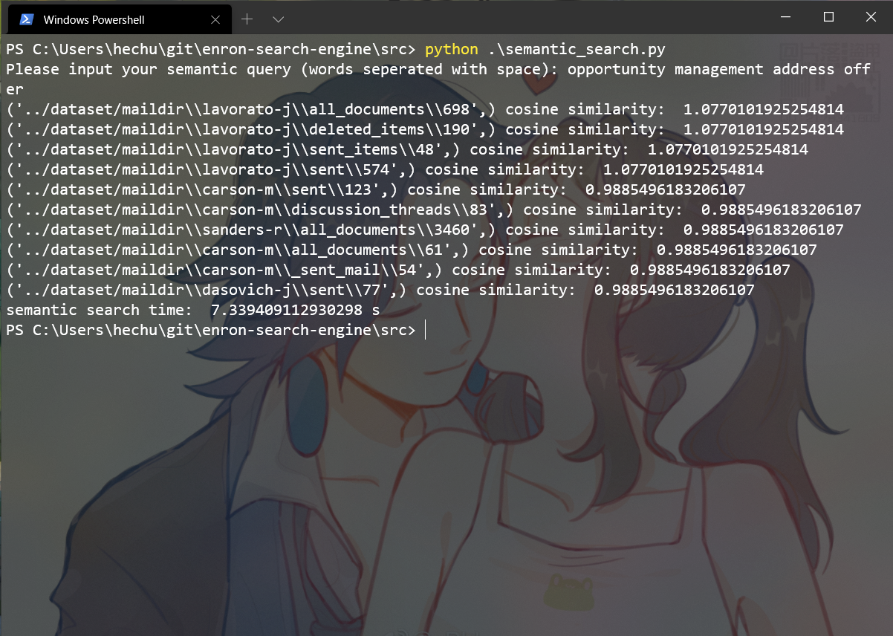
  - **opportunity, management, address, offer, price**
    执行结果：
    
  

### 总结
通过本实验，我们实现了一个bool检索和语义检索系统，加深了对倒排索引，tf-idf语义检索的理解。
在优化系统过程中，进一步加深了对搜索系统的理解。
感谢助教和老师，提供了优质的学习资源！
